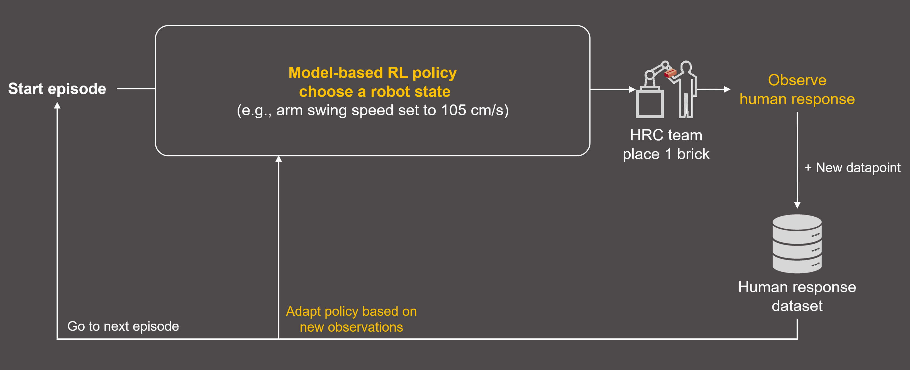
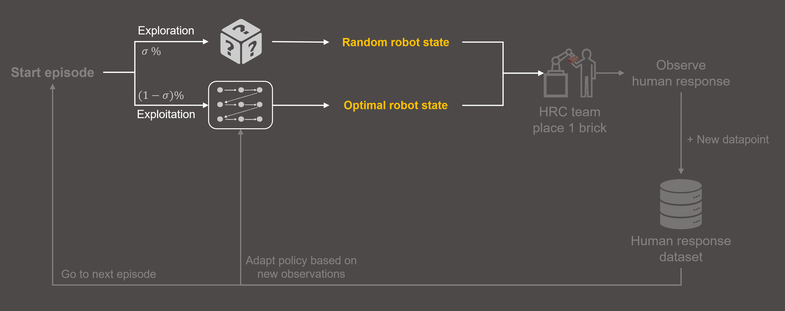
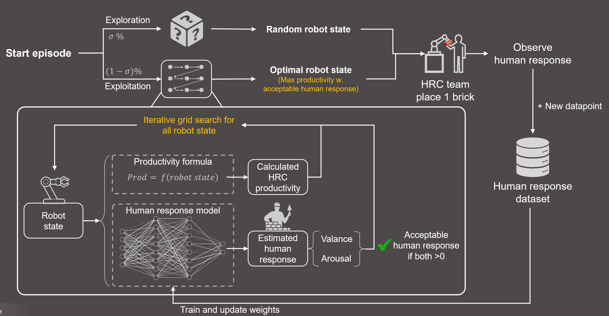

# Model-based Meta-Reinforcement Learning for Adaptive Human-Robot Collaboration

This repository contains the official implementation of the paper [Individualized Adaptive Robot Control Strategies for Cohesive Human-Robot Collaboration in Construction]().


## Installation

1. Clone the repository:
    ```
    git clone https://github.com/yourusername/your-repo.git
    ```
2. Install the required dependencies:
    ```
    pip install -r requirements.txt
    ```

## Usage

To run the project, execute the `model_based_rl.py` script. This script trains the Human Response Model and uses it to control a robot in a simulated environment. The robot's actions are guided by the predicted human responses to its state.

```bash
nohup python model_based_rl.py -norm --wandb_project 'HRC_4HR_all_7_new' --arg_notes 'new_csv-wNorm'
```

## Citation


## Quick Links

[Human response model (env) .py](rand_param_envs/gym/envs/HRC/kuka_human_response.py)

[Human response model (env) .md](rand_param_envs/gym/envs/HRC/human_response/readme.md)

## Overall Framework

- 
- 
- 


## Acknowledgements

Some modules of this project is built upon the [meta-q-learning] repository. We thank the authors for making their code publicly available.

[meta-q-learning]: https://github.com/amazon-science/meta-q-learning
